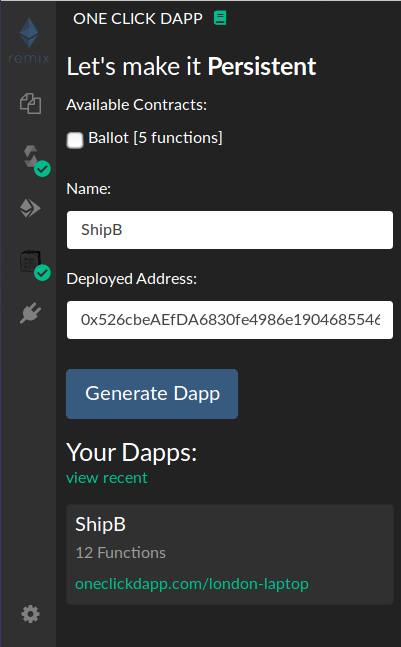

# :repeat: :one: :collision: Remix One Click Plugin

> Generate a persistent interface for your smart contract directly from Remix.



### Install

Within the [Remix Alpha IDE](https://remix-alpha.ethereum.org), click on the :electric_plug: symbol to open the plugin manager. (Not sure when or how to move to the production version of Remix)

Search for "One Click Dapp" and hit "Activate".

### Usage

1. Compile a contract using the `Solidity Compiler` plugin.
2. Open the `One Click Dapp` plugin and select "Generate"

A **unique URL will be created** for your smart contract. Bookmark it for later, or send to a friend to show off your amazing contract :tada:

:shipit: Happy coding, you rock! :sunglasses:

## Contributing

`npm install` then `npm run serve`

In the plugin manager in [Remix (alpha)](http://remix-alpha.ethereum.org), select "Connect a local plugin". In the "Api" field, enter `compilationFinished`.

Publish to surge

```bash
npm run build
cd dist
surge --domain remix.oneclickdapp.com
```

## Make your own Remix plugin

I have include a rough guide on how I made this plugin in [./making-a-new-plugin.md](./making-a-new-plugin.md)
